# V9968 + Geo3D Sample Demos

## LUNAR COMMUTE — 通勤が疲れたデモ

**My commute felt like 380,000 km today. / 通勤が38万キロくらいに感じた。**

A beautiful Earthrise becomes a cat and rabbit's trip home by rocket. Real-time textured Geo3D animation with V9968 SCREEN 8 / EPAL 256 colours, silent and automatic. 1 MiB / ASCII16. Tested in dedicated openMSX and BlueMSX+ Geo3D experimental builds with TurboR/R800; hardware and Z80 unverified.

地球の出から、猫とうさぎがロケットで帰宅する無音デモ。最後は地球へ接近します。専用openMSXとBlueMSX+のGeo3D実験版で検証、実機・Z80は未検証です。

[ROM / MP4 / GIF](https://github.com/kanon-ai/V9968_Geo3D_SampleDemo/releases/tag/lunar-commute-v0.1.0) · [Usage, technology, licenses & disclaimer / 使い方・技術・ライセンス・免責](demos/lunar-commute/README.md)

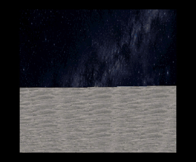

**Future validation / 今後の検証：** Future demo releases and revisions will be checked in both Geo3D-capable openMSX and BlueMSX+ builds, with exact versions and any limitations recorded per demo. This policy does not retroactively certify older releases. / 今後のデモ公開・更新は両エミュレータで確認し、版と制限を各デモに記載します。過去の全公開版を両方で検証済みとするものではありません。

## PAWS & BEATS — A Magical Concert of Twinkling Stars / 星がきらめく魔法の演奏会

A cat on xylophone and a rabbit on drums play **Twinkle, Twinkle, Little Star** with **Geo3D + OPLL**. Sprites embedded in the mallet tips meet transparent receiver sprites at the instruments; the collision flag triggers stars. **Collision is used only for this visual effect.**

猫とうさぎの演奏会。バチ先端と楽器の打面に仕込んだスプライトの接触で星がきらめきます。当たり判定は演出専用です。

**Experimental patched-openMSX validation only; physical hardware untested. Transparent contact support requires the test patch described below.** / 専用パッチ版で検証、実機未確認。対応条件をご確認ください。

[ROM / audio MP4 / GIF](https://github.com/kanon-ai/V9968_Geo3D_SampleDemo/releases/tag/paws-beats-v0.1.1) · [Usage, mechanism, licenses & disclaimer / 使い方・仕組み・ライセンス・免責](demos/paws-beats/README.md)

**PAWS & BEATS v0.1.1 — Z80 optimized:** 8.91 → 10.70 fps (+20.1%) in a forced-Z80 emulator test; R800 performance unchanged. Music runs slower on Z80. / Z80最適化で約20%改善。実機未検証。

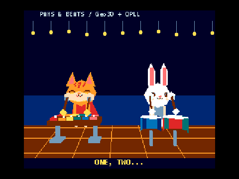

**Running the demos (2026-10-04):** Use the Geo3D-compatible emulator version listed for each demo. Newer emulator releases may not include Geo3D support. See each demo's documentation for tested environments and hardware verification status. [Compatibility details](docs/UPSTREAM_COMPATIBILITY_20261004.md)

**実行環境について（2026-10-04）：** 各デモで案内しているGeo3D対応エミュレータをご利用ください。最新版でもGeo3Dに対応していない場合があります。動作確認済みの環境や実機での検証状況は、各デモの説明をご確認ください。[互換性の詳細](docs/UPSTREAM_COMPATIBILITY_20261004.md)

## Z80 optimization update / Z80最適化更新

**Nine demos updated for Z80:** SKYBOUND, VECTOR RUSH, ORBITAL (both editions), OBSIDIAN, NIGHT RAVEN (both editions), BULLRUSH and BULLRUSH CROWD. Measured gains are approximately **8–33%** in developer openMSX with unchanged visuals. R800 retains its original bulk-transfer loop. **This update is unverified on physical hardware and BlueMSX+.** BASIC FUNCTIONS is unchanged because no speed improvement was measured; FOUR SEASONS v0.2.0 remains available below.

Z80で効果を確認した9本を更新しました。描画内容を維持し、専用openMSXで約8～33%改善。R800は従来の転送ループを使用します。本更新の実機・BlueMSX+検証は未実施です。効果のなかった基本機能デモと、更新済みの花びらデモは変更していません。

| Demo | Before / 旧版 | After / 最適化版 | Gain / 改善 |
|---|---:|---:|---:|
| BULLRUSH | 5.54 fps | 6.25 fps | +12.9% |
| BULLRUSH CROWD (5 robots) | 4.70 fps | 5.20 fps | +10.7% |
| NIGHT RAVEN | 9.95 fps | 10.75 fps | +8.0% |
| NIGHT RAVEN FLIGHT | 9.64 fps | 10.45 fps | +8.4% |
| OBSIDIAN | 5.13 fps | 5.99 fps | +16.8% |
| ORBITAL | 9.73 fps | 11.27 fps | +15.8% |
| ORBITAL TYPE REAL | 9.73 fps | 11.27 fps | +15.8% |
| SKYBOUND | 9.69 fps | 12.91 fps | +33.3% |
| VECTOR RUSH | 8.99 fps | 10.34 fps | +15.1% |
| FOUR SEASONS (v0.2.0 / 更新済み) | 4.12 fps | 12.69 fps | 3.08× |

NIGHT RAVEN FLIGHT uses scripted keyboard input; other rows use automatic playback. / NIGHT RAVEN FLIGHTはキー操作付き、ほかは自動再生での比較です。

[Updated ROMs / 更新ROM](https://github.com/kanon-ai/V9968_Geo3D_SampleDemo/releases/tag/z80-optimization-v0.1.0) · [Measurements, setup and disclaimer / 測定・実行・免責](docs/Z80_OPTIMIZATION.md)

## Geo3D BASIC FUNCTIONS — 基本機能デモ

A minimal, silent demonstration of **focal length, projection center and texture-origin scrolling**, followed by a combined scene. Fixed geometry, a black background and live register values make each effect easy to compare. **1 MiB / ASCII16.** Tested only in the dedicated Geo3D openMSX build; physical hardware and BlueMSX Plus are unverified.

焦点距離・投影中心・テクスチャ原点を個別に動かし、最後に組み合わせる無音の基本デモです。図形は固定し、上端に設定値を表示します。1 MiB / ASCII16、専用Geo3D openMSXで確認。実機・BlueMSX Plusは未検証です。

[ROM / GIF / MP4](https://github.com/kanon-ai/V9968_Geo3D_SampleDemo/releases/tag/geo3d-basics-v0.1.0) · [Guide / 技術・使い方・検証・免責](docs/GEO3D_BASICS.md)

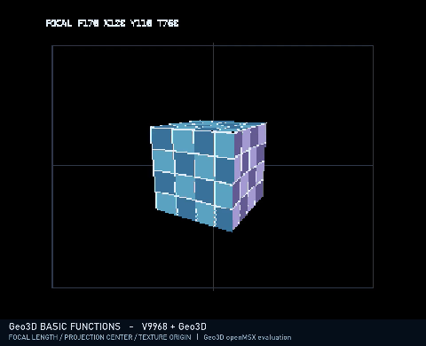

## FOUR SEASONS — ポリゴン・テクスチャの基本デモ / Polygon & Texture Basics

桜・蛍・紅葉・雪が黒背景を舞う、無音・自動の基本サンプルです。1 MiB / ASCII16。専用Geo3D openMSXで確認、BlueMSX+・実機は本デモ未検証です。

A silent, automatic demo of cherry petals, fireflies, maple leaves and snow against a black background. **1 MiB / ASCII16.** Tested in the developer Geo3D openMSX build; this demo has not yet been tested in BlueMSX+ or on physical hardware.

[ROM・GIF・MP4](https://github.com/kanon-ai/V9968_Geo3D_SampleDemo/releases/tag/four-seasons-v0.2.0) · [使い方・技術・検証・免責 / Guide & Disclaimer](docs/FOUR_SEASONS.md)

**v0.2.0: Z80向け転送最適化。** 同じ描画内容で、専用openMSXでは約4.12→12.69 fps。R800でも約10.39→27.26 fps。実機・BlueMSX+は未検証です。

**v0.2.0: Z80 transfer optimization.** Identical visuals; developer-openMSX results improved from 4.12 to 12.69 fps on Z80 and 10.39 to 27.26 fps on R800. Physical hardware and BlueMSX+ remain unverified. Preview media uses actual Z80 playback speed.

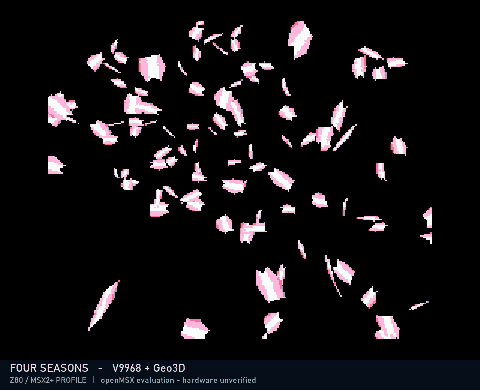

## BULLRUSH CROWD — 別バージョンの負荷実験 / Separate Load Experiment

自機1＋赤1＋青3の5機を配置した「にぎやか版」です。ゲーム本編とは別の自動走行負荷実験として追加しました。通常版も引き続き提供します。1 MiB / ASCII16、無音。専用openMSXとBlueMSX+ experimental-2で確認、実機未検証。

A separate automatic load experiment with **five robots: one player, one red and three blue**. This is not the main game; the original BULLRUSH demo remains available. Silent, 1 MiB / ASCII16. Checked in developer Geo3D openMSX and BlueMSX+ experimental-2; physical hardware is unverified. See the details for reduced geometry and measurement conditions.

[ROM・GIF・MP4](https://github.com/kanon-ai/V9968_Geo3D_SampleDemo/releases/tag/bullrush-crowd-v0.1.0) · [技術・軽量化・測定条件・使い方 / Technical Guide & Measurements](docs/BULLRUSH_CROWD.md)

## GR-9 BULLRUSH — 256色の市街地追跡デモ / 256-Color City Pursuit

探索から青い機体を発見し、ローラーダッシュ・横スライド・急旋回で市街地を追跡する無音の自動走行デモを追加しました。関節の姿勢と体重移動、屋上ショートカットを描きます。**まだ操作可能なゲームではありません。専用Geo3D openMSXで確認。BlueMSX+第2版でもASCII16指定で起動・複数場面を確認、実機未検証です。**

A silent, automatic robot pursuit through a city: find the blue robot, then follow it with roller dashes, lateral slides, sharp turns and rooftop shortcuts. Joint animation and weight shifts are part of the demonstration. **This is not yet a playable game.** Tested in developer Geo3D openMSX, with startup and multiple scenes also checked in BlueMSX+ experimental-2 using explicit ASCII16. Physical hardware is unverified.

[ROM・GIF・無音MP4](https://github.com/kanon-ai/V9968_Geo3D_SampleDemo/releases/tag/bullrush-v0.1.0) · [使い方・技術・検証・ライセンス・免責 / Guide, License & Disclaimer](docs/BULLRUSH.md)

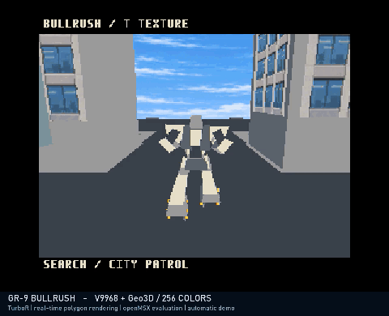

## NIGHT RAVEN — 操作できる開発体験デモ / Flight Development Demo

**完成ゲームではなく、空間を飛行する感覚を少しだけ楽しめる開発体験版です。** 従来の無音・自動再生デモとは別に追加しました。

**効果音は暫定のPSG音であり、最終版の音ではありません。BGMは未収録です。**

An interactive development demo, not a finished game. **Sound effects are temporary placeholders, not final audio.**

[ROM・動画 / v0.4.0 prerelease](https://github.com/kanon-ai/V9968_Geo3D_SampleDemo/releases/tag/v0.4.0) · [操作・技術・検証・免責](docs/NIGHT_RAVEN_FLIGHT.md)

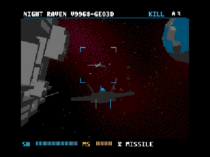

## NIGHT RAVEN v0.3.2 — 高速版 / Optimized Version

画面外の壁の転送・描画を省略。元版と一周512画面の表示VRAMが完全一致し、開発者版openMSXで測定時間を約4.1%短縮しました。無音・1MiB / ASCII16。実機未検証です。

Skips off-screen wall transfers and rendering. Display VRAM matched the original across all 512 frames of one loop, while measured loop time decreased by about 4.1% in developer openMSX. Silent, 1 MiB / ASCII16; physical hardware is unverified. The NIGHT RAVEN GIF below shows the older v0.2.0 capture, not the optimized timing.

[高速版ROM / Optimized ROM](https://github.com/kanon-ai/V9968_Geo3D_SampleDemo/releases/tag/v0.3.2) · [変更・検証詳細 / Changes & Validation](docs/NIGHT_RAVEN.md)

以下のNIGHT RAVEN GIFはv0.2.0の映像です（画面内容は同じ、速度は旧版）。

**TurboR + V9968 + Geo3Dで「こんな映像も見てみたい」を試す、従来5本の無音・自動再生デモも収録しています。**

Five silent, non-interactive experiments, including NIGHT RAVEN space combat and OBSIDIAN battleship flyby: a coastal race, a low-altitude flight, and rotating Earth/Moon spheres. These are real-time polygon rendering demos, with precomputed movement/camera tables—not prerecorded raster movies in ROM.

**まずはGeo3D開発者 Alex Moncks氏のopenMSXで確認しています。実機動作・実機速度の保証ではありません。** These demos were checked with the Geo3D developer's openMSX build. Physical hardware and other emulators are not validated. See [validation details](docs/VALIDATION.md).

## ORBITAL — TYPE REAL / 別バージョン / Fast Earth Rotation Variant

地球が月の1公転につき約27.3回自転する高速回転版です。月は同じ面を地球に向けたまま公転します。**従来のORBITALも引き続き提供します。** 実時間や実機性能を示すものではありません。

Earth rotates approximately 27.3 times per lunar orbit, while the Moon keeps the same face toward Earth. The original ORBITAL version remains available. Animation is accelerated; this is not a real-time astronomical timescale or a physical-hardware performance measurement.

[ROM・無音MP4・GIF / v0.3.1](https://github.com/kanon-ai/V9968_Geo3D_SampleDemo/releases/tag/v0.3.1) · [使い方・技術説明・検証 / Details](demos/orbital-type-real/README.md)

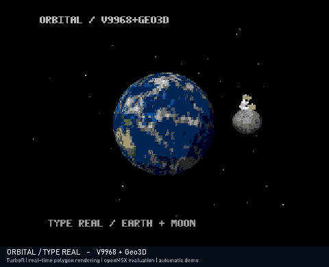

## NIGHT RAVEN — 新着 / New

巨大艦の壁沿いを突破する、リアルタイム・ポリゴン宇宙戦デモを追加しました。**効果音・BGMなし版です。カッコいいBGMを付けたいのですが、まだ決まらず悩み中。今後BGMを追加する予定です。それまでは、それぞれの「心のBGM」を重ねてお楽しみください。**

NIGHT RAVEN is currently silent (no SFX or BGM). We are still looking for the right soundtrack and plan to add BGM later. Until then, enjoy it with the soundtrack in your imagination!

[無音ROM・MP4 / v0.2.0](https://github.com/kanon-ai/V9968_Geo3D_SampleDemo/releases/tag/v0.2.0) · [使い方・技術説明・検証・免責 / Details](docs/NIGHT_RAVEN.md)

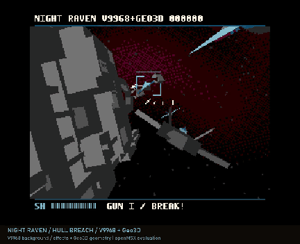

## OBSIDIAN / TITAN PASS — 最初の巨大戦艦デモ / Battleship Flyby

巨大戦艦の近傍を飛行する、最初のGeo3D実験も無音版で追加しました。1フレームあたり1,816頂点・1,302面を投入します（全ての面が常に表示されるという意味ではありません）。

A silent real-time polygon flyby near a giant spacecraft. Submits 1,816 vertices and 1,302 faces per frame; not all submitted faces are necessarily visible.

[使い方・技術説明・検証 / Guide & Validation](docs/OBSIDIAN.md) · [v0.2.0 ROM・無音MP4](https://github.com/kanon-ai/V9968_Geo3D_SampleDemo/releases/tag/v0.2.0)

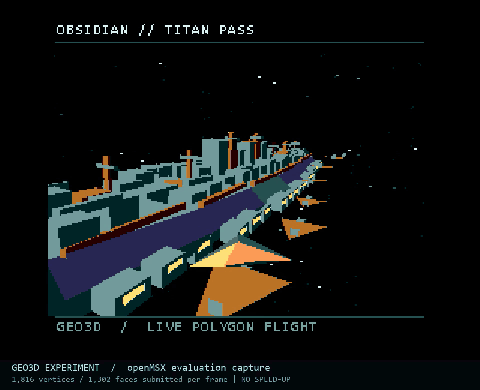

## ダウンロード / Download

[ORBITAL通常版・TYPE REAL 餅つきウサギ版 / v0.3.5](https://github.com/kanon-ai/V9968_Geo3D_SampleDemo/releases/tag/v0.3.5) — 月の上に小さなポリゴンのウサギを追加。両版のROM・GIF・無音MP4を更新しました。

[ORBITAL通常版 自転方向修正版 / v0.3.3](https://github.com/kanon-ai/V9968_Geo3D_SampleDemo/releases/tag/v0.3.3) — 通常版を西から東への自転に修正。TYPE REALはv0.3.1から変更ありません。

[ORBITAL通常版・TYPE REAL 地球テクスチャ修正版 / v0.3.1](https://github.com/kanon-ai/V9968_Geo3D_SampleDemo/releases/tag/v0.3.1) — 両版の左右反転を修正しました。

[v0.1.1 リリース・ROMと無音MP4](https://github.com/kanon-ai/V9968_Geo3D_SampleDemo/releases/tag/v0.1.1)

ROMは **ASCII16**（OBSIDIAN: 256KiB、ほか: 1MiB）。操作は不要です。音声はありません。エミュレータ・BIOS・FPGAビットストリームは同梱していません。

| Demo | 内容 | Preview |
|---|---|---|
| OBSIDIAN / TITAN PASS | 巨大戦艦への接近飛行 / battleship flyby | [Details](docs/OBSIDIAN.md) |
| NIGHT RAVEN | 巨大艦沿いの宇宙迎撃戦 / space combat | [Details](docs/NIGHT_RAVEN.md) |
| VECTOR / RUSH | 起伏とバンクのある海沿いコース、3台の車 / coastal race | [GIF](docs/media/vector-rush.gif) |
| SKYBOUND | テクスチャ付き地形、僚機2機、港湾・谷・橋 / textured low-altitude flight | [GIF](docs/media/skybound.gif) |
| ORBITAL | テクスチャ付き地球・月の自転と公転、7段階の陰影 / Earth and Moon | [GIF](docs/media/orbital.gif) |

### VECTOR / RUSH
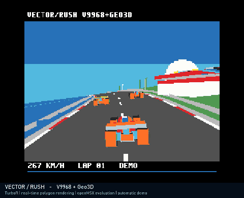

### SKYBOUND
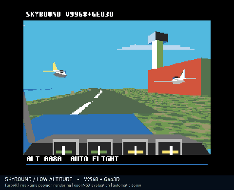

### ORBITAL
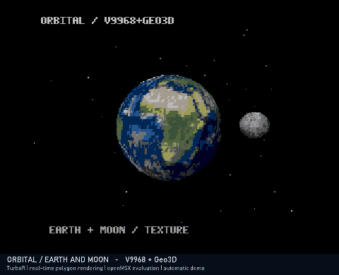

## 起動とビルド

- [使い方・必要な環境 / Usage and build](docs/USAGE.md)
- [技術説明 / Technical notes](docs/TECHNICAL.md)
- [検証した版・範囲・制約 / Validation](docs/VALIDATION.md)
- [ライセンス・素材の来歴 / Licenses and provenance](docs/LICENSE_REVIEW.md)

## クレジット / Credits

- V9968: **HRA!** — [V9968_Cartridge](https://github.com/hra1129/V9968_Cartridge)
- Geo3D: **Alex Moncks** — [Geo3D](https://github.com/alexmoncks/V9968_Cartridge/tree/main/geo3d), [Geo3D openMSX](https://github.com/alexmoncks/openMSX)
- openMSX contributors, SDCC contributors, and the authors of the build tools.
- Demo production: **Kanon**, with **ASTRA** assistance.
- SKYBOUND / ORBITAL texture images are AI-generated. 元画像と生成プロンプトを各デモの `assets/` に収録しています。

ハードウェアと周辺の創作活動を応援する非公式サンプルです。各ハードウェア開発者による認証・品質保証を意味するものではありません。

## ライセンスと免責事項 / License and disclaimer

本プロジェクトのソースコード・独自素材は、権利を有する範囲で [MIT License](LICENSE) により提供します。上流の権利・ライセンスは [THIRD_PARTY_NOTICES.md](THIRD_PARTY_NOTICES.md) を参照してください。

**試作・実験用です。現状有姿、無保証で提供します。** 動作、速度、特定機器への適合性、安全性、継続的な保守、バグ修正は保証しません。使用は利用者の判断と責任で行ってください。損害に関する責任の制限は、適用法で許される範囲に限ります。ROM・BIOS等は適法に入手したものを使用してください。

Experimental software, provided **AS IS, without warranty**. Hardware compatibility, performance, maintenance and fixes are not guaranteed. Liability limitations apply only to the extent permitted by applicable law. Use lawfully obtained system ROMs. See the MIT license for its full terms.
