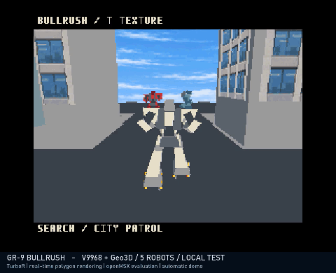

# BULLRUSH CROWD — にぎやか負荷実験版

通常のBULLRUSH／ゲーム本編とは別の、自動走行による負荷実験です。**自機1＋赤1＋青3の計5機**を街に配置します。操作可能なゲームではありません。通常版とそのリリースは変更しません。

[ROM・無音MP4・GIF](https://github.com/kanon-ai/V9968_Geo3D_SampleDemo/releases/tag/bullrush-crowd-v0.1.0)



## 実行

ROMは **1 MiB / ASCII16**。TurboR＋V9968＋Geo3Dが必要です。専用Geo3D openMSX、またはBlueMSX+ Geo3D experimental-2で、マッパーを明示してください。機種設定・BIOSの用意は[通常版の手順](BULLRUSH.md)を参照してください。TキーでテクスチャON/OFF。BGM・効果音なし、自動再生です。

```text
openmsx -machine Panasonic_FS-A1ST_V9968 -ext geo3d -cart BULLRUSH-CROWD.ROM -romtype ASCII16
```

BlueMSX+はV9968 / 256kBに設定したTurboR機種で、`/romtype1 ASCII16`を指定します。

## 何を増やしたか

元の自機・青機・カメラ・関節ポーズ・街の経路を保持し、位相をずらした追加3機を配置しました。追加機は赤1＋青2です。各機は固定IDを保持し、画面外や壁に完全に隠れる追加機を省略します。部分的な遮蔽は手前の壁・屋根の再描画で処理します。汎用Zバッファや機体同士の衝突判定ではありません。

追加機の胴体・関節モデルは148頂点・109面。負荷を抑えるため追加機だけ独立した車輪2個の描画を省略し、脚・ブーツは保持しています。自機と元の青機の車輪は維持。赤用パレットを確保し、同じAI生成テクスチャを再量子化しています。

ポリゴン描画はリアルタイムですが、576組の移動・カメラ・関節データは事前計算です。自由な逃走AIやゲーム全体の処理負荷を評価するものではありません。最大5機を描画投入、平均約3.89機であり、常に全5機が画面内に見えるという意味ではありません。

## 検証と速度（2026-10-03）

Geo3D開発者openMSX `de29fb854885a38251c03e24596ad4ff95770ef2` の同じ378更新区間をエミュレーション時間で測定しました。

|配置機数|平均描画更新/秒|区間所要時間|
|---|---:|---:|
|通常相当2機|約12.48|約30.29秒|
|4機|約11.20|約33.74秒|
|採用5機|約10.97|約34.46秒|
|6機|約10.57|約35.76秒|

5機版も通常相当より約12%更新頻度が低く、区間は約14%長くなります。にぎやかさと速度の折衷として5機を選びました。ハードウェアの最大描画数を確定する結果ではありません。

BlueMSX+ experimental-2 (`2090cd265928e5290b7939d7447cf76184dd6d07`)でもASCII16指定で起動・複数場面を確認しました。5機版のローカル実時間観測は約8.46更新/秒でしたが、こちらはホスト実時間による参考値で、上表とは測定方法が異なり直接比較できません。全フレームの画素一致は未検証です。**実機・FPGAでの動作と速度は未検証です。**

通常版ROMと元の姿勢データの維持、追加機ID、復元点92ファイルのハッシュ、公開ソースからの再ビルド一致を確認。GIFと無音MP4は約34.46秒、速度変更・フレーム補間なし。GIFは15MB未満です。映像内のLOCAL TEST表記はこの実験の収録時の表記です。

[負荷測定](validation/bullrush-crowd-benchmark.json)・[比較検証](validation/bullrush-crowd-checks.json)・[映像情報](validation/bullrush-crowd-media.json)

## ビルド

Python 3、NumPy、Pillow、SDCCを使用します。SDCCのbinをPATHまたはSDCC_BINに設定してください。CROWD_EXTRASは未設定（既定4）でビルドします。

```text
python -m pip install -r demos/bullrush-crowd/requirements.txt
python demos/bullrush-crowd/build.py
python demos/bullrush-crowd/variants.py
```

**配布対象は `demos/bullrush-crowd/out/BULLRUSH-5robots.ROM`** です。最初に生成されるBULLRUSH.ROMは6機の母体データで、配布5機版とは異なります。variants.pyが固定IDで機数別ROMを作ります。

5機版SHA-256: `6bbb7e19ce411e12c8eedf3aa9440142e7b882ec14907b24f8285b0b6ce104b1`

## ライセンス・免責

独自コード・形状・文書は[MIT](../LICENSE)。Geo3D / V9968由来の表記を[第三者表記](../THIRD_PARTY_NOTICES.md)およびLICENSESに保持しています。テクスチャは参照画像なしのAI生成で、[来歴・プロンプト](../demos/bullrush-crowd/assets/PROVENANCE.md)を同梱。保有する権利の範囲で提供し、独占的権利や第三者の権利不存在を保証しません。商用ゲームのモデル・画像・音楽は含みません。

BIOS、エミュレータ、FPGAビットストリーム、ツール、フォントファイル、個人設定は配布しません。現状有姿・無保証で提供します。将来の仕様変更への互換性、実機性能、ゲームとしての完成を保証するものではありません。公式承認を意味しません。

## English

A separate, silent automatic load experiment, not the main game: one player, one red and three blue robots. 1 MiB ASCII16. Real-time polygon rendering with precomputed paths and poses. Additional robots omit separate wheel meshes. Checked in developer Geo3D openMSX and BlueMSX+ experimental-2; physical hardware is unverified. Media is not sped up. MIT with retained upstream notices; provided as is.
