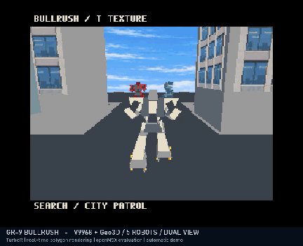

# BULLRUSH CROWD COCKPIT — 5機・両視点の負荷実験版

通常版・ゲーム本編とは別の自動走行デモです。**自機1＋赤1＋青3**を配置。1周目は追尾、2周目はコックピット視点で、以降交互に繰り返します。従来の1MiB版も維持しています。

[ROM・無音MP4・GIF・ソース](https://github.com/kanon-ai/V9968_Geo3D_SampleDemo/releases/tag/bullrush-crowd-cockpit-v0.1.0)



## 起動・操作

**ROMは2 MiB / ASCII16です。** TurboR＋V9968＋Geo3D対応エミュレータを使用し、マッパーはASCII16を明示してください。実カートリッジの容量対応・実機動作は未検証です。[機種設定の説明](BULLRUSH.md)も参照してください。

```text
openmsx -machine Panasonic_FS-A1ST_V9968 -ext geo3d -cart BULLRUSH-CROWD-COCKPIT.ROM -romtype ASCII16
```

- Cキー：走行位置を保ったまま視点を切り替え。
- Tキー：テクスチャON/OFF。
- 自動走行のみ。移動操作・戦闘・衝突判定はありません。音楽・効果音なし。

BlueMSX+ではV9968 / 256kB設定のTurboR機種を使い、`/romtype1 ASCII16`を指定します。BIOS等は利用者が正当に用意してください。

## 描画と高速化

ポリゴン描画はリアルタイム、経路・カメラ・関節姿勢・建物による遮蔽データは事前計算です。コックピットでは自機の胴体と車輪を描かず、他の4機を維持します。細い2D窓枠と照準、静的な計器風バーを重ねています。バーはゲーム状態を示す計器ではありません。

左右で同一の車輪モデルを再利用し、2個目の重複転送を省略しました。それぞれの変換・描画は独立して実施し、1個目が画面外の場合は通常どおり転送します。追加3機は従来の負荷実験版と同じ、独立車輪を省略した軽量モデルです。

追尾レコードはROMバンク16～33、コックピットは64～81、遮蔽データは82～126。赤機の色指定などと共有する127番の予約値を保持します。128バンクの2MiB構成です。

**機体同士の衝突や汎用Zバッファは未実装です。** 接近すると機体が重なったりカメラの目前を横切る場面があります。建物の遮蔽は壁・屋根の再描画による演出用の処理です。ゲーム本編の自由移動やAI性能を示すものではありません。

## 検証（2026-10-08）

Geo3D開発者openMSX `de29fb854885a38251c03e24596ad4ff95770ef2` で2周分の表示を確認。Cキーの両方向切替、TキーのOFF/ON、周回による切替を確認しました。従来5機版の全576レコードで変換データ・機体IDを比較し維持を確認。元の98ファイルはハッシュ付き復元点に保存し、不変を検証しました。公開用ソースからの再ビルドROMも検証済みROMとの一致を確認しています。

|視点|378更新の時間|平均更新/秒|
|---|---:|---:|
|追尾|31.857秒|11.865|
|コックピット|25.766秒|14.670|

いずれもエミュレーション時間。公開済みにぎやか版の追尾測定値10.969更新/秒に対し約8.2%改善しています。視点により描画する物体と画素数が異なるため、カメラ比較を単一処理の高速化率と解釈しないでください。

BlueMSX+ experimental-2 `2090cd265928e5290b7939d7447cf76184dd6d07` では2MiB ASCII16で起動し、両視点の描画カウンタの進行を確認。**BlueMSX+の目視・全画素比較は未実施**です。両エミュレータの確認範囲は同一ではありません。実機・FPGA未検証です。

[速度](validation/bullrush-crowd-cockpit-speed.json)・[切替](validation/bullrush-crowd-cockpit-keys.txt)・[BlueMSX+](validation/bullrush-crowd-cockpit-blue.json)・[映像](validation/bullrush-crowd-cockpit-media.json)

映像は約57.76秒、無音、再生速度変更・フレーム補間なし。GIFは約13.4MBです。

## ビルド

Python 3、NumPy、Pillow、SDCCのsdasz80/sdldz80が必要です。SDCCのbinをPATHまたはSDCC_BINで指定。CROWD_EXTRASは未設定（既定3）としてください。

```text
python -m pip install -r demos/bullrush-crowd-cockpit/requirements.txt
python demos/bullrush-crowd-cockpit/build.py
```

出力：`demos/bullrush-crowd-cockpit/out/BULLRUSH.ROM`。今回はこれが5機版で、variants.pyは不要です。

## ライセンス・免責

独自コード・形状・文書は[MIT](../LICENSE)。Geo3DおよびV9968由来の表記を[第三者表記](../THIRD_PARTY_NOTICES.md)とLICENSESに保持しています。テクスチャは参照画像なしのAI生成で[来歴](../demos/bullrush-crowd-cockpit/assets/PROVENANCE.md)を同梱。保有する権利の範囲で提供し、独占的権利や第三者の権利不存在を保証しません。商用ゲームの画像・モデル・音楽は含みません。BIOS、エミュレータ、FPGAビットストリーム、ツール、フォントファイル、個人設定は配布しません。

本配布物はゲーム本編とは別の技術・負荷実験用サンプルです。実機での動作、安全性、速度、互換性、将来のゲーム化を保証しません。測定値は記載したエミュレータ環境に限定され、実機性能や最大処理能力を示すものではありません。利用・改変は利用者の判断と責任で行ってください。適用法令で認められる範囲で、作者・貢献者は利用または利用不能により生じた損害について責任を負いません。各ハード・エミュレータ開発者の公式承認・性能保証を意味しません。詳細はMIT Licenseの免責条項に従います。

## English

Separate five-actor dual-camera load experiment, not an interactive game. 2 MiB ASCII16. C switches chase/cockpit; T toggles textures. Alternating laps. Silent media at original speed. Visually checked in developer openMSX; BlueMSX+ experimental-2 checked for startup and advancing counters in both views only. Physical hardware is unverified. MIT with upstream notices retained; provided as is, without warranty.
