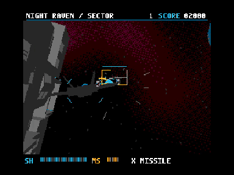

# NIGHT RAVEN — Three-stage development demo v0.5.0

**開発途中の操作可能なデモです。完成ゲーム・最終版ではありません。**

**音楽（OPLL BGM）・効果音（PSG）は暫定で、今後更新予定です。ステージ進行も最終版とは異なる可能性があります。** 操作、敵の挙動、難易度、演出、構成は開発中です。更新の時期は未定です。

**This is an unfinished playable development demo, not a final game. Music and sound effects are provisional and planned for replacement/update. Stage progression may differ from the final version.** No completion or update schedule is promised.

[ROM・MP4・GIF / Download](https://github.com/kanon-ai/V9968_Geo3D_SampleDemo/releases/tag/night-raven-three-stage-v0.5.0)



## 内容 / Content

外壁への突入、設備搬送路から反応炉の広間、白烏との戦闘の3面構成です。タイトル、射撃、ロックオン、3発の分散誘導ミサイル、シールド、ボス、再挑戦を含みます。旧自動デモおよび旧飛行体験版は別版として残しています。

Three provisional sectors: outer fortress, service lane/reactor chamber, and White Raven. Runtime controls, combat, lock-on missiles, shield, bosses and retry are included. Earlier automatic and flight demos remain separate editions.

## 実行 / Run

1 MiB ASCII16 ROM。TurboR/R800 + V9968 + Geo3D対応環境を想定。まずGeo3D開発者版openMSXで確認してください。通常のopenMSXではGeo3D非対応の場合があります。BIOS・エミュレータ・FPGA実装は同梱していません。

```powershell
& 'C:/path/to/geo3d-openmsx/openmsx.exe' -machine Panasonic_FS-A1ST_V9968 -ext geo3d -cart './NIGHT_RAVEN_THREE_STAGE.ROM' -romtype ASCII16
```

|操作|キー|
|---|---|
|移動|方向キー|
|開始・射撃・再挑戦|Space|
|ロック後の誘導ミサイル|X|
|一時停止・再開|Esc|
|区間の再開始|F1|

ジョイスティック1の方向・第1/第2ボタンにも入力処理がありますが、本版で物理ジョイスティックは未検証です。OPLL対応構成で暫定BGM、PSGで暫定効果音を鳴らします。

## 技術 / Technology

16色のSCREEN 5を使用。TurboR側がゲーム状態を更新し、Geo3Dへモデル・姿勢を送り、リアルタイムに変換・投影・ポリゴン描画します。V9968のVRAMと描画機能を併用します。背景経路にはテーブルを使いますが、ゲーム映像の録画再生ではありません。

2面は全区画の床を先に描き、その後に設備を描画。床の点検用くぼみ・蓋は実ジオメトリです。2面ボスは左右・上下・奥行きに周期移動します。全面的な自由飛行物理シミュレーションではありません。

Python 3 / NumPy / Pillow / SDCC assembler-linkerを別途用意してください。

```powershell
python -m pip install -r requirements.txt
$env:SDCC_BIN='C:/path/to/sdcc/bin'
python demos/night-raven-three-stage/build.py
```

出力: `demos/night-raven-three-stage/out/NIGHT_RAVEN_THREE_STAGE.ROM`。

## 検証 / Verification — 2026-10-08

今回のROMは専用Geo3D開発者版openMSX、Panasonic_FS-A1ST_V9968 + geo3d、TurboR/R800構成で確認。今回の版はBlueMSX+・実機・FPGA・Z80モードでは未検証です。過去の別版の検証結果を本版へ引き継ぎません。

配布ソースからの再ビルドROMが検証済みROMとSHA-256一致。画面端、一時停止・再開、再開始、無操作での敗北と再挑戦のテストも通過。

自動キー操作で1・2面の撃破と3面への移行を確認。最終記録の自動操作は3面で敗北しており、本版の全3面クリアの確認とはしていません。2面ボスは非攻撃状態で約16秒、32回の座標取得で各軸の継続移動を確認しました。2面前半の記録区間は約26.4更新/秒（5秒で132更新）。これはエミュレータ内のゲーム更新数で、実機性能や一定FPSの保証ではありません。

MP4は同ROMのエミュレータ収録で暫定音あり、GIFは無音の抜粋です。再生速度の引き上げはしていません。GIFは15MB未満。

Only the dedicated developer Geo3D openMSX build is verified for this revision. BlueMSX+, physical hardware/FPGA and Z80 mode are untested. Automated play cleared sectors 1–2 and entered sector 3, then lost. Emulator timings are not hardware performance claims.

## ライセンス / License

独自ソース・手続き生成モデル・HUD・暫定音楽・効果音は、権利を有する範囲で[MIT](../LICENSE)。Geo3D由来の部分の著作権表示は[第三者通知](../THIRD_PARTY_NOTICES.md)および[Geo3D MIT](../LICENSES/Geo3D-MIT.txt)を保持。[V9968の通知](../LICENSES/V9968-MIT.txt)も参照してください。エミュレータ・BIOS・外部ツールにはそれぞれのライセンスが適用され、本配布には含めません。今回の床検討用AI画像はROM・配布素材に含めていません。

Original code/procedural assets/provisional audio are MIT-licensed to the extent the contributors hold rights. Retain upstream notices. External emulators, BIOS and tools are not bundled and retain their own licenses.

## 免責 / Disclaimer

試作を現状有姿・無保証で提供します。動作、互換性、性能、保守、完成、将来の更新を保証しません。利用に伴う損害については、適用法令で認められる範囲で責任を負いません。非公式の応援・開発デモであり、ハードウェア作者による品質認証ではありません。利用環境のデータは各自で保護してください。

Provided AS IS, without warranty. Compatibility, performance, maintenance, completion and future updates are not guaranteed. Liability is excluded only to the extent permitted by applicable law. This unofficial demo is not a hardware-author certification.
